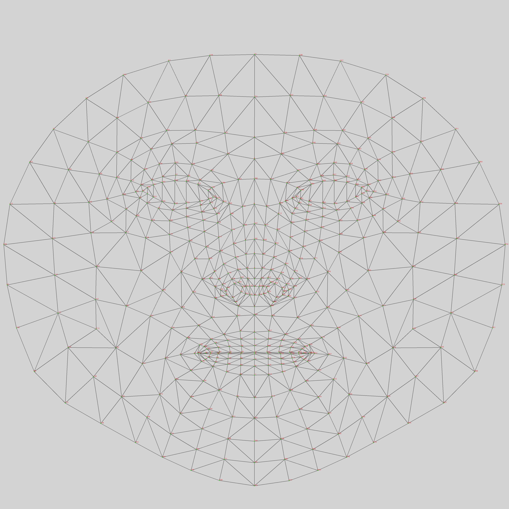
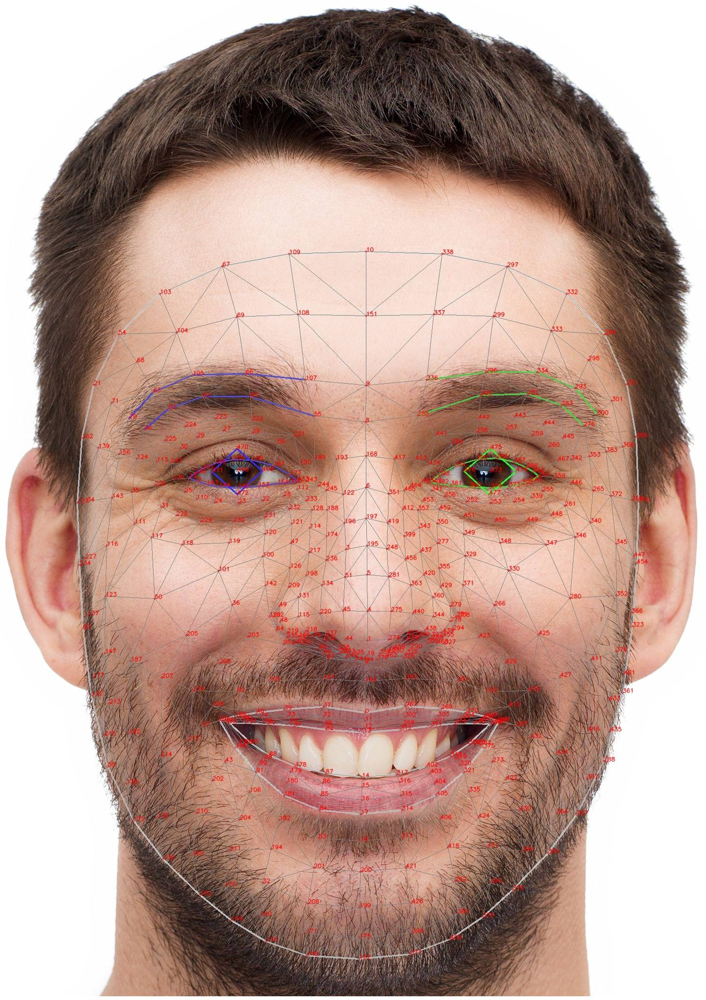

# Real-time Landmark Streamer for ASL Recognition

Este proyecto captura **landmarks faciales, de pose y de manos** en tiempo real usando [MediaPipe Tasks](https://developers.google.com/mediapipe) y los envía a un servidor backend en Python para su procesamiento. Está diseñado como base para un sistema de interpretación de lenguaje de señas americano (ASL), considerando también señales no manuales (expresiones faciales, dirección, contacto).

---

## 🎯 Funcionalidad

- Captura en tiempo real desde la cámara web.
- Detecta:
  - **Landmarks faciales** (468 puntos).
  - **Pose corporal** (33 puntos).
  - **Ambas manos** (21 puntos por mano).
- Separa landmarks por **lado izquierdo / derecho** en cara y cuerpo.
- Envío periódico al servidor mediante `fetch()` POST.
- Diseñado para entrenamiento o interpretación de ASL en tiempo real.

---

## 🖼️ Mapas de referencia

### Mapa completo de la malla facial (468 puntos)



---

### Mapa simplificado (índices clave para ASL)



---

## 🛠️ Basado en MediaPipe

Este proyecto utiliza [MediaPipe](https://developers.google.com/mediapipe), una biblioteca de Google para detección eficiente de puntos clave en visión por computadora.

- 📌 [MediaPipe Face Landmarker](https://developers.google.com/mediapipe/solutions/vision/face_landmarker)
- 📌 [MediaPipe Hand Landmarker](https://developers.google.com/mediapipe/solutions/vision/hand_landmarker)
- 📌 [MediaPipe Pose Landmarker](https://developers.google.com/mediapipe/solutions/vision/pose_landmarker)

---

## 🚀 Cómo usar

1. Clona el repositorio y asegúrate de tener las imágenes `mesh_map.jpg` y `aGdBV.jpg` en la raíz.
2. Asegúrate de que tu servidor Python esté listo para recibir `POST` con los campos:
   ```json
   {
     "timestamp": 1721374872929,
     "face": [...],
     "pose": [...],
     "hands": [leftHand, rightHand]
   }
  ```
3. Abre el archivo HTML en navegador moderno con acceso a cámara.

4. Verifica los landmarks en consola o en backend.

## 📁 Estructura esperada
   ```json
   /repo-root
│
├── index.html            ← interfaz y lógica JS
├── mesh_map.jpg          ← mapa completo de cara
├── aGdBV.jpg             ← mapa simplificado
├── server.py             ← backend receptor (opcional)
└── README.md             ← este archivo
   ```

## 🧠 Próximos pasos sugeridos
- Agregar segmentación por zonas faciales (cejas, párpados, mejillas, etc.).

- Reconocimiento de señas usando modelos de clasificación.

- Exportar secuencias como JSON o TFRecords.

- Visualización interactiva de landmarks recibidos en Python (con matplotlib o three.js).

## 📜 Licencia
Este proyecto está en desarrollo educativo y experimental. Puedes adaptarlo libremente, citando la fuente si es posible.
MediaPipe es propiedad de Google LLC y se rige bajo sus propios términos de uso.
   ```css
¿Quieres que también cree una versión en inglés o te gustaría que se genere un `index.html` mínimo con esas imágenes para mostrar en pantalla?
   ```